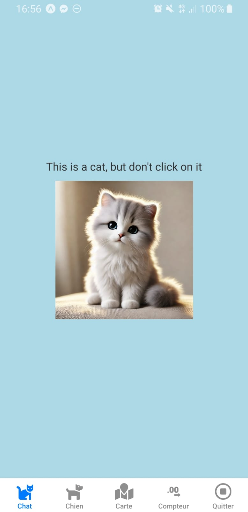
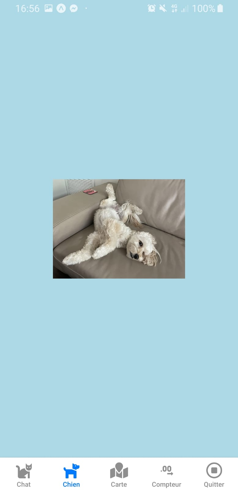
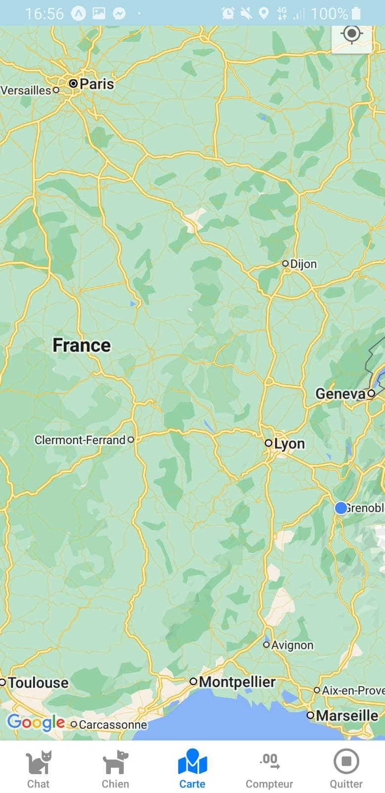

# Application Interactive : Chat, Chien et Carte

## Description

Cette application permet d'interagir avec un chat et un chien, d'afficher une carte centrée sur la position de l'utilisateur avec les villes de Paris et Toulon, de suivre le nombre de clics sur le chat et le chien, et de préparer un SMS en appuyant sur l'image du chien. Un bouton permet de quitter l'application.

### Fonctionnalités principales :
- **Chat interactif** : Un chat qui joue un son lorsque vous cliquez dessus et qui augmente le compteur de clics.
- **Chien interactif** : Un chien qui, lorsqu'on clique dessus, prépare un SMS.
- **Carte interactive** : La carte affiche la position de l'utilisateur ainsi que les villes de Paris et Toulon.
- **Compteurs de clics** : Affichez le nombre de fois où vous avez cliqué sur le chat et le chien.
- **Bouton Quitter** : Permet de quitter l'application.

## Installation

1. Clonez ce dépôt sur votre machine locale :
   - `git clone <URL_DU_REPOSITORY>`

2. Accédez au dossier du projet :
   - `cd <Dossier_Du_Projet>`

3. Installez les dépendances :
   - `npm install`

4. Lancez l'application :
   - `npm start`

## Fonctionnalités détaillées

### 1. Chat Interactif
Le chat est une image cliquable. Lorsqu'on clique dessus, un son se joue et le compteur de clics du chat augmente.

- **Image du chat** : 
- **Son du chat** : Lors de chaque clic, un bruit de chat est joué.

### 2. Chien Interactif
Le chien est une autre image cliquable. Lorsque l'utilisateur clique sur l'image du chien, un SMS est préparé.

- **Image du chien** : 

### 3. Carte Interactive
La carte est centrée sur la position de l'utilisateur, avec les villes de Paris et Toulon affichées.

- **Vue de la carte** : 

### 4. Compteurs de Clics
Chaque animal (chat et chien) possède un compteur qui enregistre le nombre de fois où l'utilisateur a cliqué dessus.

### 5. Quitter l'application
Un bouton est disponible pour quitter l'application.

## Technologies utilisées

- **React Native / Expo** : Pour le développement de l'application mobile.
- **Expo Audio** : Pour jouer des sons lors des clics sur le chat.
- **React Navigation** : Pour la gestion de la navigation entre les écrans.
- **AsyncStorage** : Pour stocker les compteurs de clics de manière persistante.
- **Expo Battery** : Pour afficher l'état de la batterie et changer la couleur de fond de l'application en fonction du niveau de batterie.

## Démos

### 1. Chat et Chien

Voici une démonstration des animaux interactifs :

 | 

### 2. Carte

Voici une vue de la carte avec la position de l'utilisateur, Paris et Toulon :

### 3 Quit

## 4 count

---

## License

Ce projet est sous licence MIT - voir le fichier [LICENSE](./LICENSE) pour plus de détails.
